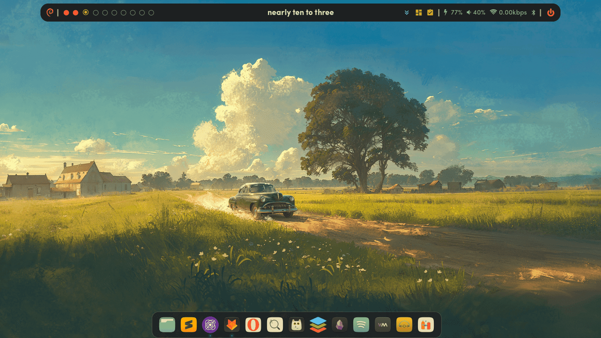

Real men don't use backups, they post their stuff on a ~public FTP server~ GitHub and let the rest of the world make copies.

## Highlights
* [gruvbox](https://github.com/morhetz/gruvbox) everywhere 😻
* [eww bar](https://elkowar.github.io/eww/) with [fuzzy clock](https://github.com/coreymwamba/bash-fuzzy-clock)
* [rofi](https://davatorium.github.io/rofi/) launcher
* [picom](https://github.com/pijulius/picom) compositor (with animations, somewhat buggy)
* [plank](https://github.com/ricotz/plank) dock
* touchpad gestures with [fusuma](https://github.com/iberianpig/fusuma)

## Gallery

## Credits
This setup was possible only because of:
* [hidayry/dotfiles-bspwm](https://github.com/hidayry/dotfiles-bspwm/) and all the people whose  config I've shamelessly stolen.
* The awesome community on [r/unixporn](https://reddit.com/r/unixporn)
* Various GNU/Linux and _(insert tool name)_ forums.
